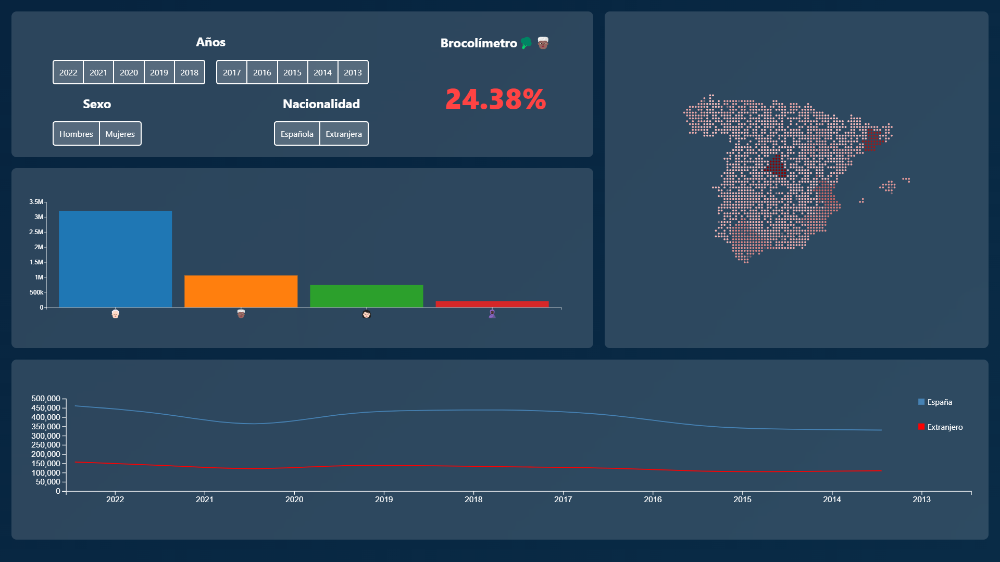
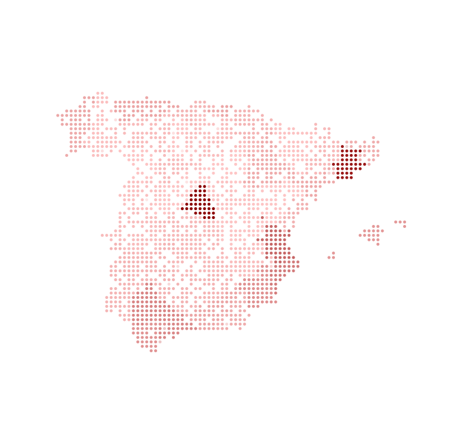
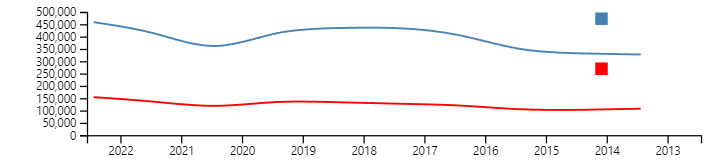

# 🥦 Brocolímetro

El **Brocolímetro** es una página web interactiva que interpreta los datos del INE (Instituto Nacional de Estadística) sobre las personas condenadas en España. Utilizando mapas y gráficas interactivas, puedes explorar los datos según el sexo, la nacionalidad y los años seleccionados.

## 🚀 Características

- **Mapas Interactivos**: Visualiza los datos en un mapa de España.
- **Gráficas Interactivas**: Compara los datos mediante gráficas de líneas y barras.
- **Filtros Dinámicos**: Filtra los datos por sexo, nacionalidad y años.
- **Totalmente Responsive**: La página y los gráficos SVG se adaptan a cualquier tamaño de pantalla.

## 🛠️ Tecnologías Utilizadas

- **D3.js**: Para la generación de gráficos y mapas interactivos.
- **HTML5**: Estructura de la página web.
- **CSS3**: Estilos y diseño responsivo.
- **JavaScript**: Lógica y manipulación del DOM.

## 📊 Visualizaciones

### Mapa Interactivo

### Gráfica de Líneas

### Gráfica de Barras

## 📋 Cómo Usar

1. Simplemente entra a **[Brocolímetro](https://alexcerezo.github.io/brocolimetro)**.
2. **Selecciona los Filtros**: Usa los checkboxes para seleccionar el sexo, la nacionalidad y los años que deseas visualizar.
3. **Explora los Datos**: Interactúa con los mapas y las gráficas para obtener información detallada.
4. **Responsive**: Disfruta de una experiencia optimizada en cualquier dispositivo, ya sea móvil, tablet o escritorio.

## 🤝 Contribuciones

¡Las contribuciones son bienvenidas! Si tienes alguna idea o mejora, no dudes en abrir un issue o enviar un pull request.

## 📄 Licencia

Este proyecto está bajo la Licencia MIT. Consulta el archivo [LICENSE](LICENSE) para más detalles.

## 📞 Contacto

Si tienes alguna pregunta o sugerencia, puedes contactarme en [info@alexcerezo.es](info@alexcerezo.es).

---

¡Gracias por usar el Brocolímetro! 🥦📊

---

**AVISO⚠️: NO SOY RACISTA**
